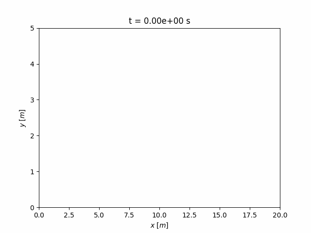
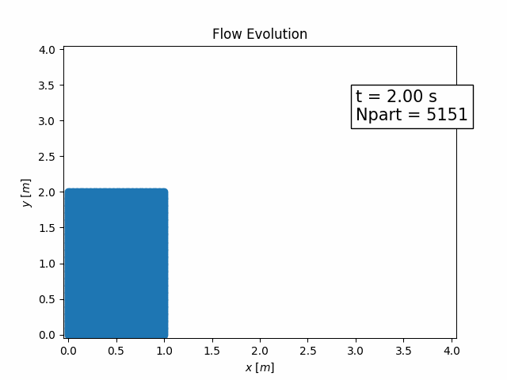

# CryoPy: A Python Framework for Cryolava Simulation using SPH



**CryoPy** is a Python-based numerical simulation toolkit for **fluid dynamics** and **heat transfer**, primarily using the **Smoothed Particle Hydrodynamics (SPH)** method. This library make an intensive use of the [PySPH Library](https://pysph.readthedocs.io/en/main/index.html), licensed under the BSD 3-Clause License (See [PySPH License](https://github.com/pypr/pysph/blob/main/LICENSE.txt) for details). It is designed to model **cryolava scenarios**, including avalanches, fluidized snow, and ice/water mixtures.

---

## 📚 About PySPH
We would like to thank the [PySPH Community](https://groups.google.com/g/pysph-users?pli=1) - without their contributions, this toolkit would not have been possible.
PySPH is a Python-based framework for Smoothed Particle Hydrodynamics (SPH). It allows users to define complete SPH simulations using pure Python and generates high-performance code for execution on CPUs, GPUs, or distributed systems using MPI. 

**Citation:** If you use PySPH in your work, please refer to the original authors:

```bibtex
@article{10.1145/3460773,
    author = {Ramachandran, Prabhu and Bhosale, Aditya and Puri, Kunal and Negi, Pawan and Muta, Abhinav and Dinesh, A. and Menon, Dileep and Govind, Rahul and Sanka, Suraj and Sebastian, Amal S. and Sen, Ananyo and Kaushik, Rohan and Kumar, Anshuman and Kurapati, Vikas and Patil, Mrinalgouda and Tavker, Deep and Pandey, Pankaj and Kaushik, Chandrashekhar and Dutt, Arkopal and Agarwal, Arpit},
    title = {PySPH: A Python-based Framework for Smoothed Particle Hydrodynamics},
    year = {2021},
    issue_date = {December 2021},
    publisher = {Association for Computing Machinery},
    address = {New York, NY, USA},
    volume = {47},
    number = {4},
    issn = {0098-3500},
    url = {https://doi.org/10.1145/3460773},
    doi = {10.1145/3460773},
    abstract = {PySPH is an open-source, Python-based, framework for particle methods in general and Smoothed Particle Hydrodynamics (SPH) in particular. PySPH allows a user to define a complete SPH simulation using pure Python. High-performance code is generated from this high-level Python code and executed on either multiple cores, or on GPUs, seamlessly. It also supports distributed execution using MPI. PySPH supports a wide variety of SPH schemes and formulations. These include, incompressible and compressible fluid flow, elastic dynamics, rigid body dynamics, shallow water equations, and other problems. PySPH supports a variety of boundary conditions including mirror, periodic, solid wall, and inlet/outlet boundary conditions. The package is written to facilitate reuse and reproducibility. This article discusses the overall design of PySPH and demonstrates many of its features. Several example results are shown to demonstrate the range of features that PySPH provides.},
    journal = {ACM Trans. Math. Softw.},
    month = sep,
    articleno = {34},
    numpages = {38},
    keywords = {PySPH, smoothed particle hydrodynamics, open source, Python, GPU, CPU}
}
```

---

## 📂 Project Structure

```text
CryoPy/
│
├── .gitignore
├── INSTALLATION.md                            # Detailed installation instructions
├── LICENSE.txt                                # License for the toolkit
├── README.md                                  # What you're reading
│
├── docker-compose.yml                         # Docker Compose configuration
├── Dockerfile                                 # Docker image definition (Ubuntu 22.04 + PySPH)
│
├── install_pysph.sh                           # Local installation with OpenMPI support
├── install_pysph_slurm_cray_mpich.sh          # Installation on Cray clusters (MPICH)
├── install_pysph_slurm_nocray.sh              # Installation on Slurm clusters (OpenMPI)
│
├── requirements_bases.txt                     # Core dependencies (serial mode)
│
└── framework/                                 # Main working directory (mounted in Docker)
    │
    ├── main_db.py                             # Dam Break example
    │
    ├── apps/                                  # Simulation scenarios
    │   ├── DB2D.py                            # 2D fluid simulation
    │   ├── DB2DFluidized.py                   # 2D fluidized material simulation
    │   ├── DB2DSnow.py                        # 2D snow simulation
    │   ├── FissureInletAvalanche.py           # Avalanche simulation through a fissure
    │   ├── FissureInletMix.py                 # Mixture simulation through a fissure
    │   └── FissureInletSnow.py                # Snow simulation through a fissure
    │
    ├── benchmarks/
    │   ├── heat_transfer/                     # Thermal modeling benchmarks (WIP)
    │   └── hydrodynamics/                     # Fluid dynamics validation (Dam Break)
    │       ├── crespo_2007_*.csv              # SPH numerical reference (Crespo et al., 2007)
    │       ├── koshizuka_oka_*.csv            # Experimental reference (Koshizuka & Oka, 1996)
    │       └── db_analysis.ipynb              # Analysis and comparison notebook
    │
    ├── modules/                               # Core physics and geometry modules
    │   ├── FluidDynamics.py                   # Fluid dynamics equations and models
    │   ├── Geometries.py                      # Geometry generation (fissures, blocks, reservoirs)
    │   ├── HeatTransfer.py                    # Heat transfer models
    │   ├── Integrators.py                     # Time integrators
    │   └── TimeStep.py                        # Adaptive time step management
    │
    └── outputs/                               # Simulation output files (created for simulations)
```

---

## 📦 Prerequisites

- **Python 3.8.10** or **Python 3.10** (Compatibility problems from Python 3.11 and above)
- **PySPH** (and scientific dependencies: `numpy`, `matplotlib`, etc.)

### ⚙️ Installation Scripts
To simplify setup, use one of the provided scripts:
- `install_pysph.sh`: Local installation with parallel support.
- `install_pysph_slurm_nocray.sh`: Installation on non-Cray clusters with openMPI.
- `install_pysph_slurm_cray_mpich.sh`: Installation on Cray clusters with MPICH.

> ⚠️ **Note**
> If installing **PySPH** on a cluster, ensure the correct **Python** and **MPI** modules are loaded.

> ⚠️ **Warning**
> If your distro is too recent, we recommend using the docker image given in this repo

For detailed instructions, see **[INSTALLATION.md](./INSTALLATION.md)**.

---

## 🌊 Example Usage: 2D Dam-Break Flow Simulation



An available example simulates the classical dam-break problem in 2D using the Smoothed Particle Hydrodynamics (SPH) method. A column of fluid is initially held behind a virtual dam. When the simulation starts, the dam is removed, and the fluid collapses under gravity, spreading downstream.

To run it, just run:
```bash
(env_PySPH) $ python main_db.py
```
You can customize physical and geometric parameters directly in `main_db.py`.

---

## Analysis & Validation: Dam Break Benchmark

This repository includes a Jupyter Notebook (`db_analysis.ipynb`, in the `/benchmarks/hydrodynamics/` folder) dedicated to the post-processing and validation of the SPH dam break simulations (results from `main_db.py`).

### 📊 Methodology
The analysis focuses on the temporal evolution of the fluid collapse, compared against classical benchmarks:
* **Experimental:** Koshizuka & Oka (1996)
* **Numerical (SPH):** Crespo et al. (2007)

The notebook extracts two key physical metrics:
1. **Front Position ($x_{max}$):** The maximum horizontal extent of the fluid.
2. **Residual Height ($y_{max}$):** The fluid height measured at the left wall (monitored within a window $x \in [0.48, 0.52]$ to avoid wall adhesion artifacts).

### ⚙️ Physical Scaling
To ensure rigorous comparison, dimensionless data from the literature are converted back to physical time using:
$$t = \frac{T}{\sqrt{2g/L}}$$
where $g = 9.81 \, \text{m/s}^2$ and $L$ is the initial length of the column.

### 📈 Quantitative Validation
The notebook performs a quantitative assessment using **Root Mean Square Error (RMSE)**. Simulation results are linearly interpolated onto the experimental time-steps to ensure a point-to-point error calculation.

### 🚀 Usage
1. Ensure the simulation outputs are located in `../outputs/` or specify it directly in the notebook.
2. Install dependencies: `pip install numpy pandas matplotlib scipy natsort SciencePlots`.
3. (Optional) Ensure a LaTeX distribution (like TeX Live or MiKTeX) is installed for high-quality figure rendering.
4. Run all cells in `db_analysis.ipynb`.

## 🔧 Creating Custom Scenarios

To add a new scenario:
1. Create a file in the `apps/` directory.
2. Implement a class inheriting from `Application`:
   ```python
   class MyOwnApp(Application):
       def initialize(self):
           # Define initial parameters
           pass

       def create_particles(self):
           # Create particles using geometries from `modules/Geometries.py`
           pass

       def create_equations(self):
           # Use equations from:
           # - `modules/FluidDynamics.py` (fluid dynamics)
           # - `modules/HeatTransfer.py` (heat transfer)
           # - `modules/TimeSteps.py` (time step computation)
           pass

       def create_solver(self):
           # Define solvers for particle groups
           # Integrators are available in `modules/Integrators.py`
           pass
   ```
Feel free to extend or modify existing modules for your specific needs!

---

## 📝 Author
**Bastien Bodin**

## Cite
```bibtex
@software{cryopy,
    title={CryoPy: A Python Framework for Cryolava Simulation using SPH},
    author={Bastien Bodin},
    year={2025},
    url={https://github.com/bastien-bodin/CryoPy}
}
```

## License
[BSD-3](./LICENSE.txt)

## 🆘 Support
For questions, bug reports, or feature requests, please:
- Open an issue on GitHub
- Contact: [bastien.bodin@proton.me](mailto:bastien.bodin@proton.me)